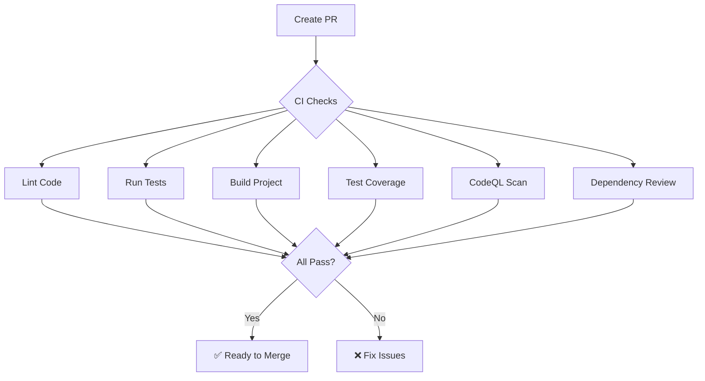

# Code Quality Tools Setup 🛡️

This project uses **free GitHub-provided tools** to ensure code quality, security, and maintainability.

## 🎯 Integrated Tools

### 1. **CodeQL** - Security & Code Quality Analysis
**What it does**: Automated security vulnerability detection and code quality scanning  
**Free for**: Public repositories  
**Runs**: On every push/PR + weekly scheduled scan

**Configuration**: `.github/workflows/codeql.yml`

#### Features
- ✅ Security vulnerability detection
- ✅ Code quality issues
- ✅ Common bug patterns
- ✅ Best practice violations
- ✅ SQL injection, XSS, and other security flaws

#### How to View Results
1. Go to your GitHub repository
2. Click **Security** tab
3. Click **Code scanning alerts**
4. Review any findings and fix them

---

### 2. **Dependabot** - Automated Dependency Updates
**What it does**: Automatically creates PRs to update dependencies and security patches  
**Free for**: All repositories  
**Runs**: Weekly on Mondays

**Configuration**: `.github/dependabot.yml`

#### Features
- ✅ Automatic dependency updates
- ✅ Security vulnerability patches
- ✅ GitHub Actions updates
- ✅ Grouped updates (dev vs production)
- ✅ Configurable review schedule

#### What You'll See
- Weekly PRs for dependency updates
- Grouped by dev dependencies and production dependencies
- Automatic labels: `dependencies`, `automated`
- Security alerts for vulnerable packages

---

### 3. **Dependency Review** - PR Vulnerability Check
**What it does**: Checks every PR for vulnerable or prohibited dependencies  
**Free for**: Public repositories  
**Runs**: On every pull request

**Configuration**: `.github/workflows/dependency-review.yml`

#### Features
- ✅ Blocks PRs with vulnerable dependencies
- ✅ License compliance checking
- ✅ Fails on moderate+ severity vulnerabilities
- ✅ Comments on PRs with findings

#### Allowed Licenses
- MIT, Apache-2.0, BSD-2-Clause, BSD-3-Clause, ISC, 0BSD

#### Blocked Licenses
- GPL-3.0, AGPL-3.0 (copyleft licenses)

---

### 4. **Codecov** - Test Coverage Reporting
**What it does**: Tracks test coverage and reports on PRs  
**Free for**: Public repositories  
**Runs**: On every push/PR

**Configuration**: CI workflow includes coverage upload

#### Setup Required
1. Go to [codecov.io](https://codecov.io/)
2. Sign in with GitHub
3. Enable your repository
4. Copy the Codecov token
5. Add to GitHub: Settings → Secrets → `CODECOV_TOKEN`

#### Features
- ✅ Coverage reports on PRs
- ✅ Coverage trends over time
- ✅ Line-by-line coverage view
- ✅ Fails if coverage drops significantly

---

### 5. **Enhanced CI Pipeline** - Quality Gates
**What it does**: Runs linting, tests, and builds on every PR  
**Free for**: All repositories  
**Runs**: On every push/PR

**Configuration**: `.github/workflows/ci.yml`

#### Checks Performed
1. ✅ **Linting** - Code style and quality (ESLint)
2. ✅ **Tests** - All unit tests must pass
3. ✅ **Build** - Code must compile successfully
4. ✅ **Coverage** - Test coverage reporting

---

## 📊 Quality Dashboard

Once set up, you'll have:

### Security Tab
- CodeQL security scanning results
- Dependabot security alerts
- Dependency graph
- Security advisories

### Actions Tab
- CI pipeline status
- CodeQL analysis runs
- Dependency review results
- Test coverage trends

### Pull Requests
- Automatic checks must pass
- Coverage reports
- Dependency vulnerability warnings
- Code quality feedback

---

## 🚀 Setup Steps

### 1. Enable CodeQL (One-time)
CodeQL should work automatically once you push the workflow file.

**Verify**:
1. Push the `.github/workflows/codeql.yml` file
2. Go to **Security** → **Code scanning**
3. Wait for first scan to complete

---

### 2. Enable Dependabot (Automatic)
Dependabot activates automatically with the config file.

**Verify**:
1. Push `.github/dependabot.yml`
2. Go to **Insights** → **Dependency graph** → **Dependabot**
3. Should show "Active" status

**Update Reviewer**:
Edit `.github/dependabot.yml` and replace `chiragmak10` with your GitHub username.

---

### 3. Enable Codecov (Optional but Recommended)

#### Step-by-step:
1. **Sign up on Codecov**
   - Go to [codecov.io](https://codecov.io/)
   - Click "Sign up with GitHub"
   - Authorize Codecov

2. **Enable Repository**
   - Find `react-setup` in the list
   - Click to enable

3. **Get Token**
   - Click on repository in Codecov
   - Go to Settings
   - Copy the repository upload token

4. **Add to GitHub**
   - Go to repository on GitHub
   - Settings → Secrets and variables → Actions
   - New repository secret
   - Name: `CODECOV_TOKEN`
   - Value: (paste token)

5. **Verify**
   - Create a PR
   - Codecov bot should comment with coverage report

**If you skip Codecov**: The CI will still work, coverage just won't be uploaded.

---

## 📋 Workflow Summary



---

## 🎨 Status Badges

Add these to your `README.md` to show build status:

```markdown
[](https://github.com/chiragmak10/react-setup/actions/workflows/ci.yml)
[](https://github.com/chiragmak10/react-setup/actions/workflows/codeql.yml)
[](https://codecov.io/gh/chiragmak10/react-setup)
```

Replace `chiragmak10/react-setup` with your actual GitHub username/repo.

---

## 🔧 Configuration Files

| File | Purpose |
|------|---------|
| `.github/workflows/ci.yml` | Main CI pipeline (lint, test, build) |
| `.github/workflows/codeql.yml` | Security scanning |
| `.github/workflows/dependency-review.yml` | PR dependency checks |
| `.github/dependabot.yml` | Automated dependency updates |

---

## 📈 What You Get

### On Every Pull Request
- ✅ Linting check
- ✅ All tests must pass
- ✅ Build must succeed
- ✅ Coverage report
- ✅ Security scan
- ✅ Dependency vulnerability check

### Weekly
- 📦 Dependency update PRs (Mondays)
- 🔍 Scheduled CodeQL security scan

### Always On
- 🚨 Security alerts in Security tab
- 📊 Dependency graph
- 🎯 Code quality insights

---

## 💡 Benefits

1. **Catch bugs early** - Before they reach production
2. **Security** - Automatic vulnerability detection
3. **Maintainability** - Consistent code quality
4. **Up-to-date deps** - Automatic updates
5. **Confidence** - Know your code works
6. **Professional** - Industry-standard practices

---

## 🆘 Troubleshooting

### CodeQL not running?
- Check Security tab → Code scanning
- Verify workflow file is in `.github/workflows/codeql.yml`
- Ensure repository is public (or has GitHub Advanced Security)

### Dependabot not creating PRs?
- Check Settings → Security → Dependabot
- Verify `.github/dependabot.yml` is committed
- Wait for Monday (scheduled day)

### Coverage not uploading?
- Add `CODECOV_TOKEN` secret
- Check if coverage files are generated locally
- Review CI logs for upload errors

---

## 🎓 Industry Standard

These tools are used by:
- ✅ React, Vue, Next.js
- ✅ TypeScript, VS Code
- ✅ Major open source projects
- ✅ Enterprise codebases

**All completely free for public repositories!** 🎉

---

## 📚 Learn More

- [CodeQL Documentation](https://codeql.github.com/)
- [Dependabot Documentation](https://docs.github.com/en/code-security/dependabot)
- [Dependency Review](https://docs.github.com/en/code-security/supply-chain-security/understanding-your-software-supply-chain/about-dependency-review)
- [Codecov Documentation](https://docs.codecov.com/)
