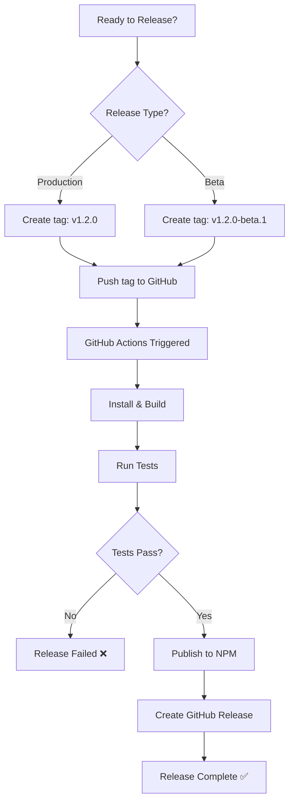

# Semantic Release - Tag-Based Release Guide

This project uses a **tag-based semantic release** workflow - releases only happen when you create a version tag.

## 🎯 Overview

- **Manual control**: You decide when to release by creating a tag
- **Automatic publishing**: Once tagged, CI/CD handles NPM publish and GitHub release
- **Simple workflow**: No complex commit message parsing required
- **Support for pre-releases**: Use `-beta` suffix for beta versions

## 📋 Release Types

### Production Release
- Tag format: `v1.0.0`, `v1.2.3`, etc.
- NPM tag: `latest`
- GitHub: Full release

### Pre-release (Beta)
- Tag format: `v1.0.0-beta.1`, `v1.2.0-beta.2`, etc.
- NPM tag: `beta`
- GitHub: Pre-release

## 🚀 How to Create a Release

### Option 1: Using Git Commands (Recommended)

#### Production Release
```bash
# 1. Make sure you're on main branch
git checkout main
git pull origin main

# 2. Create and push tag
git tag v1.2.0
git push origin v1.2.0

# ✨ CI/CD automatically:
#    - Builds the project
#    - Runs tests
#    - Publishes to NPM with 'latest' tag
#    - Creates GitHub release
```

#### Beta Release
```bash
# 1. Make sure you're on beta branch
git checkout beta
git pull origin beta

# 2. Create and push tag
git tag v1.2.0-beta.1
git push origin v1.2.0-beta.1

# ✨ CI/CD automatically:
#    - Builds the project
#    - Runs tests
#    - Publishes to NPM with 'beta' tag
#    - Creates GitHub pre-release
```

### Option 2: Using NPM Version Command

```bash
# Production release (minor version bump)
npm version minor  # 1.0.0 → 1.1.0
git push --follow-tags

# Production release (patch version bump)
npm version patch  # 1.0.0 → 1.0.1
git push --follow-tags

# Production release (major version bump)
npm version major  # 1.0.0 → 2.0.0
git push --follow-tags

# Beta release
npm version 1.2.0-beta.1
git push --follow-tags
```

### Option 3: GitHub Web Interface

1. Go to your repository on GitHub
2. Click "Releases" → "Create a new release"
3. Click "Choose a tag"
4. Type tag name (e.g., `v1.2.0`)
5. Check "Create new tag on publish"
6. Set release title and description
7. For beta: Check "This is a pre-release"
8. Click "Publish release"

## 📦 Version Numbering (Semantic Versioning)

Follow [semver.org](https://semver.org/) conventions:

```
v[MAJOR].[MINOR].[PATCH]
```

| Version Part | When to Bump | Example |
|--------------|--------------|---------|
| **MAJOR** | Breaking changes | `v1.0.0 → v2.0.0` |
| **MINOR** | New features (backward compatible) | `v1.0.0 → v1.1.0` |
| **PATCH** | Bug fixes (backward compatible) | `v1.0.0 → v1.0.1` |

### Pre-release Versions
```
v[MAJOR].[MINOR].[PATCH]-beta.[NUMBER]
```

Examples:
- `v1.0.0-beta.1` - First beta of version 1.0.0
- `v1.0.0-beta.2` - Second beta of version 1.0.0
- `v2.0.0-beta.1` - First beta of version 2.0.0

## 🔄 Complete Release Workflow



## 💡 Examples

### Example 1: First Stable Release
```bash
git checkout main
git tag v1.0.0
git push origin v1.0.0
```

### Example 2: Bug Fix Release
```bash
# Current version: 1.2.3
# After fixing bugs:
git checkout main
git tag v1.2.4
git push origin v1.2.4
```

### Example 3: New Feature Release
```bash
# Current version: 1.2.4
# After adding features:
git checkout main
git tag v1.3.0
git push origin v1.3.0
```

### Example 4: Beta Testing
```bash
# Test new major version before stable release
git checkout beta
git tag v2.0.0-beta.1
git push origin v2.0.0-beta.1

# After feedback, release beta 2
git tag v2.0.0-beta.2
git push origin v2.0.0-beta.2

# When ready, release stable on main
git checkout main
git tag v2.0.0
git push origin v2.0.0
```

## 📥 Installing Versions

### As a User

```bash
# Install latest stable
npm install create-react-forge

# Install specific version
npm install create-react-forge@1.2.0

# Install beta version
npm install create-react-forge@beta

# Install specific beta
npm install create-react-forge@1.2.0-beta.1
```

## 🔑 Required Setup

### GitHub Secrets

Add `NPM_TOKEN` to your GitHub repository:

1. Create NPM automation token:
   - Go to [npmjs.com](https://www.npmjs.com/)
   - Account Settings → Access Tokens
   - Generate New Token → Automation

2. Add to GitHub:
   - Repository Settings → Secrets and variables → Actions
   - New repository secret
   - Name: `NPM_TOKEN`
   - Value: (paste your NPM token)

## ⚠️ Important Guidelines

✅ **DO**:
- Always create tags from `main` for production releases
- Use `beta` branch or feature branches for pre-releases
- Follow semantic versioning strictly
- Test thoroughly before creating production tags
- Use descriptive GitHub release notes

❌ **DON'T**:
- Don't create tags without testing
- Don't reuse or delete tags that have been pushed
- Don't manually edit versions in `package.json` (let CI handle it)
- Don't skip version numbers

## 🛠️ Troubleshooting

### Tag Already Exists
```bash
# Delete local tag
git tag -d v1.2.0

# Delete remote tag (use carefully!)
git push origin :refs/tags/v1.2.0

# Create new tag
git tag v1.2.0
git push origin v1.2.0
```

### Release Failed
1. Check GitHub Actions logs
2. Ensure tests are passing
3. Verify NPM_TOKEN secret is set
4. Check tag format is correct (`v1.2.0` not `1.2.0`)

### Wrong Version Published
- You cannot "unpublish" from NPM after 24 hours
- Create a new patch version with the fix
- Use `npm deprecate` to warn users about problematic versions

## 📊 Checking Current Version

```bash
# See all tags
git tag -l

# See current version in package.json
npm version

# See published versions on NPM
npm view create-react-forge versions
```

## 🎓 Quick Reference

| Task | Command |
|------|---------|
| Patch release (1.0.0 → 1.0.1) | `git tag v1.0.1 && git push origin v1.0.1` |
| Minor release (1.0.0 → 1.1.0) | `git tag v1.1.0 && git push origin v1.1.0` |
| Major release (1.0.0 → 2.0.0) | `git tag v2.0.0 && git push origin v2.0.0` |
| Beta release | `git tag v1.1.0-beta.1 && git push origin v1.1.0-beta.1` |
| List all tags | `git tag -l` |
| Delete local tag | `git tag -d v1.0.0` |
| Delete remote tag | `git push origin :refs/tags/v1.0.0` |

## 📚 Additional Resources

- [Semantic Versioning](https://semver.org/)
- [NPM Version Documentation](https://docs.npmjs.com/cli/v9/commands/npm-version)
- [Git Tagging](https://git-scm.com/book/en/v2/Git-Basics-Tagging)
